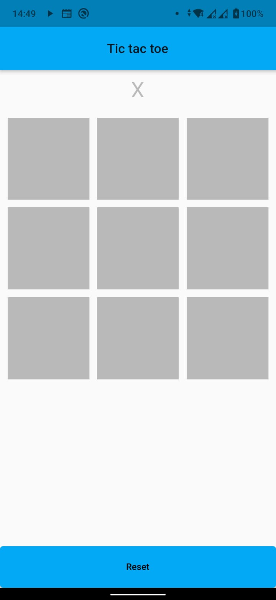
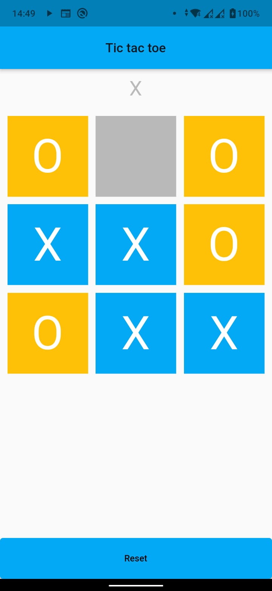
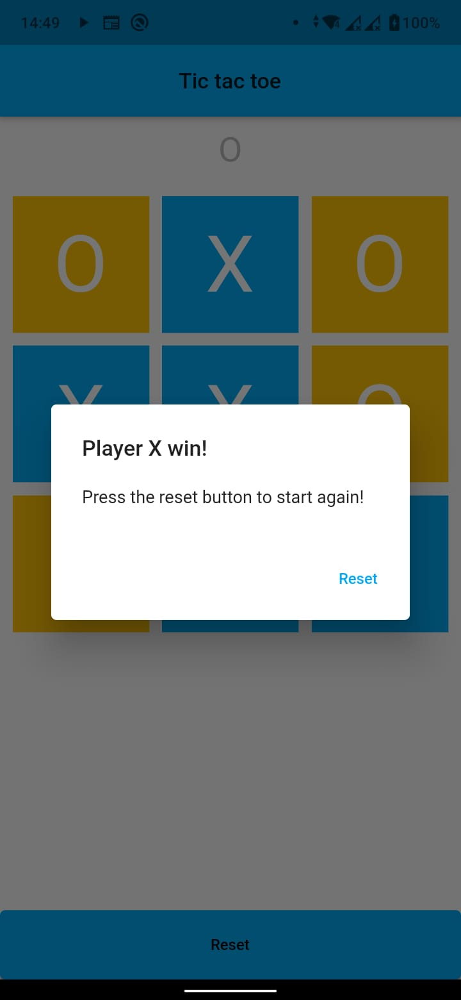

# Tic Tac Toe 
Simple Tic Tac Toe implementation in Flutter. ❌⭕️

<center>
  
  
  
</center>

##### 💻 Build
```
flutter run
```

##### 🔗 Reference
[Criando um jogo da velha (Tic Tac Toe) com Flutter](https://medium.com/flutter-comunidade-br/criando-um-jogo-da-velha-em-flutter-50347537c926)